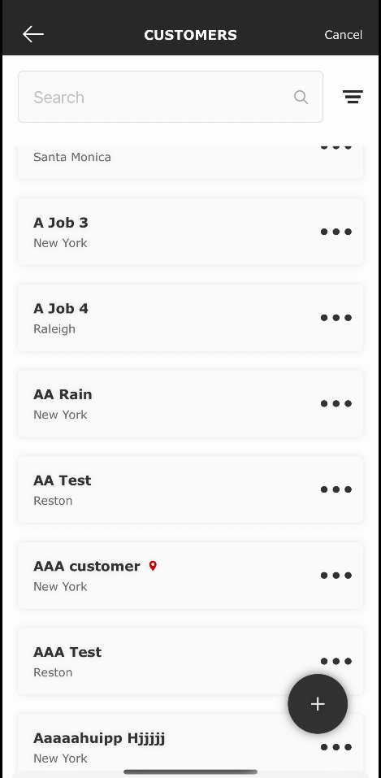
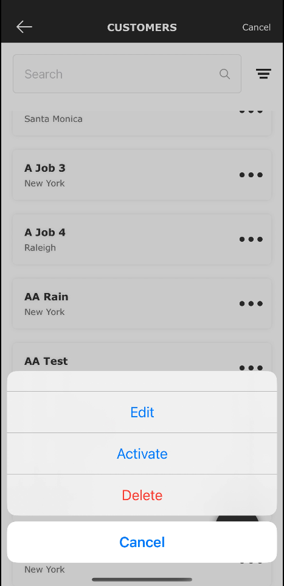
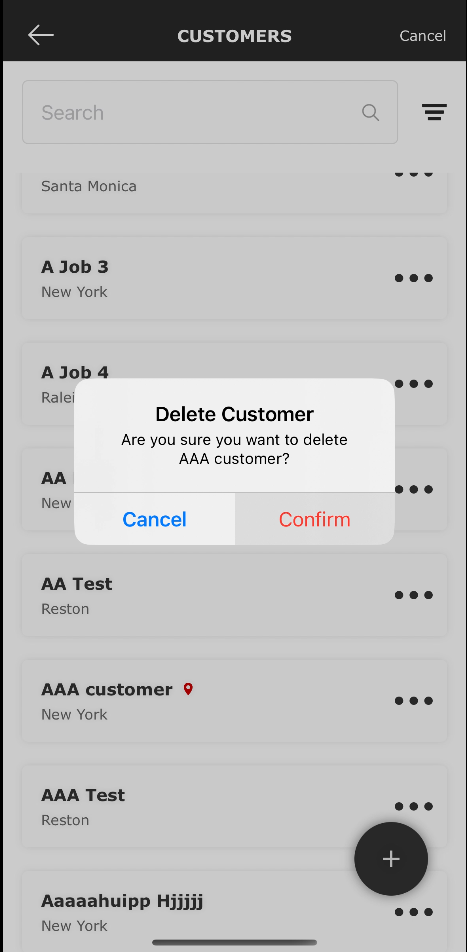

# Phonebook App

The Phonebook App is an iOS mobile application designed to manage and organize your contacts efficiently. It allows users to add, edit, delete, and search for contacts with ease.

## Features

- Add new contacts with details like name, phone number, and email.
- Edit existing contact information.
- Delete contacts from the phonebook.
- Search for contacts by name or phone number.
- User-friendly interface for seamless navigation.

## Screenshots

